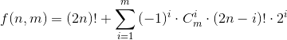

# Important notes

## Solutions

|     Language      | Test set 1 | Test set 2 |
|:-----------------:|:----------:|:----------:|
| [GoLang](ways.go) |    PASS    |    PASS    |

## About the problem

Factorials, powers of 2, and inverse modulars (which are used in the calculation of combination numbers) are precalculated.
